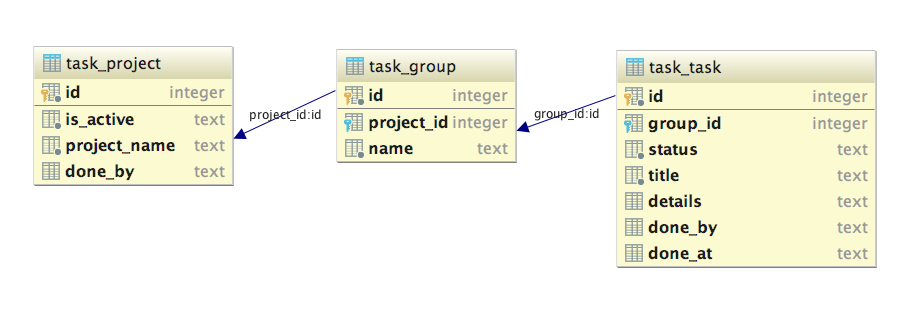

TaskComplete
====

A task management application based on Symfony framework 
for learning the framework as well as some layered architecture. 

### license

MIT License

### installation

if you are interested in installing it, execute following commands. 

1. `git clone https://github.com/asaokamei/TaskComplete`
2. `cd TaskComplete`
3. `composer install`
3. please make `TaskComplete/var/sqlite` directory is writable 
for the web server and to you. 
4. `php bin/console doctrine:schema:update --force`

to populate database with sample small data, 

5. run `php bin/console server:run`
6. and access [http://localhost:8000/settings/initialize](http://localhost:8000/settings/initialize) with browser.
7. populate with sample data. 

### database 

The database has tables: 

